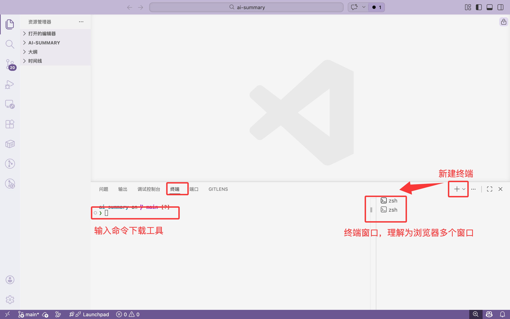
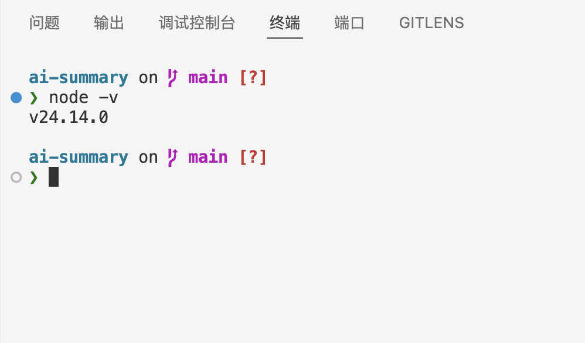
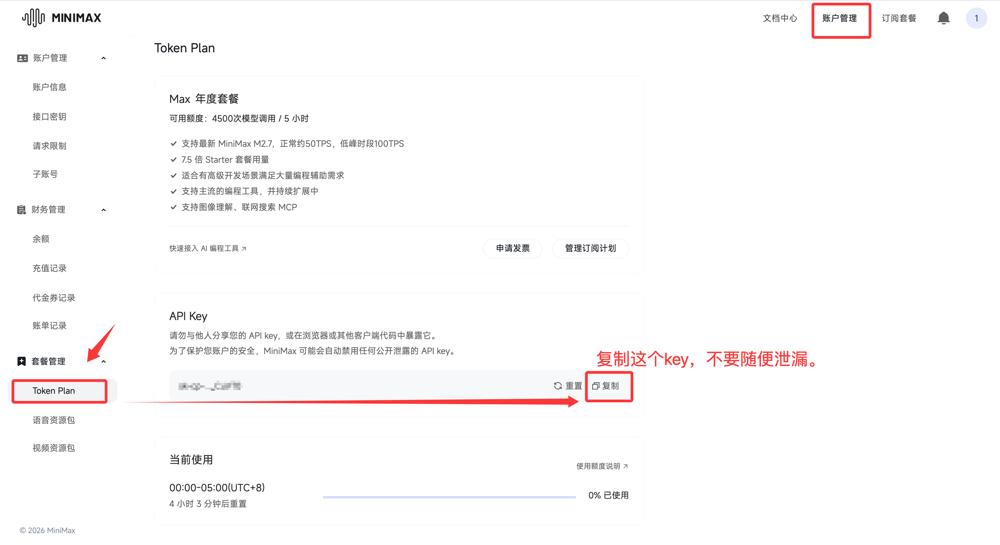

# 02_安装教程：全程终端命令，跟着敲就行

> 作者：mong  
> 最后更新：2026-03-19  
> 适合人群：已看完 `01_零基础三步走.md`，准备真正动手的同学  
> 💡 完成后你会得到：一个能打开工作区、能在侧边栏可视化调用 AI、能开始做任务的完整环境
> 这里以macOS为例为大家讲解，注意！和win不一样的地方我也会提出来。

---

## 开始之前

你需要准备：
1. 一台能联网的电脑（Windows 或 Mac）。
2. 一点点耐心——如果中间任何步骤卡住了，不要慌，复制报错信息，打开 [z.ai](https://z.ai)（智谱的免费 AI 对话），把报错贴给它，让它帮你分析。**学会自己向 AI 求助，本身就是这套教程最核心的能力之一。**

> 💡 本教程的所有安装**全程在终端（命令行）里完成**，不需要你去各种官网手动下载安装包。你只需要搞清楚命令的执行顺序，一行一行复制粘贴、回车就行。

---

## 第一步：安装 VSCode

VSCode 是我们整个 AI 工作区的"大本营"。官网：[code.visualstudio.com](https://code.visualstudio.com/Download)

这是唯一一个需要你去官网点"Download"下载安装包的步骤。（如果你不知道下载哪个版本，那么截图去问上面的z.ai）

1. 打开浏览器，访问上面的官网，点击巨大的 **Download** 按钮。
2. 下载后双击安装包：
   - **Mac**：直接拖进"应用程序"文件夹即可。
   - **Win**：安装过程中如果你有自己放软件的盘和文件夹（比如 D 盘），记得在安装路径那一步点"浏览"改到你想放的位置（如 `D:\VSCode`），然后一路"下一步"。
3. 安装完成后，打开 VSCode。

> **[📷 截图占位：VSCode 首次打开的欢迎界面]**


### 汉化（强烈推荐）

1. 点击左侧边栏最下面由几个方块组成的图标（**扩展 / Extensions**）。
2. 搜索 `Chinese`，找到 `Chinese (Simplified) (简体中文)`，点 `Install`。
3. 右下角弹框点 `Change Language and Restart`，重启后界面全中文。

> **[📷 截图占位：扩展市场搜索 Chinese 并点击 Install 的界面]**


### 几个救命快捷键（先记住这三个就够了）

| 功能 | Windows | Mac |
|---|---|---|
| 打开文件夹 | `Ctrl + O` | `Cmd + O` |
| 打开/关闭终端 | `` Ctrl + J `` | `` Cmd + J `` |
| 打开命令面板 | `Ctrl + Shift + P` | `Cmd + Shift + P` |

> 💡 后面所有的安装命令，都是在 VSCode 的终端里敲的。按上面的快捷键打开终端就行。


---

## 第二步：安装前置环境（Node.js）

Claude Code 运行需要 Node.js 18 或更高版本。我们先检查你电脑里有没有，如果没有再装。

### 🔍 先检查：打开 VSCode 终端，输入

```bash
node -v
```

- **如果显示了版本号**（比如 `v18.17.0` 或 `v20.x.x`），而且大版本号 ≥ 18，说明已经装好，**跳过这一步**。
- **如果显示了版本号但 < 18**，需要更新，按下面的方式重新装一遍即可（会自动覆盖旧版本）。
- **如果报错 `command not found`** 或 `不是内部命令`，说明没装过，往下走。

> **[📷 截图占位：终端输入 node -v 后显示版本号的画面]**


### Mac 安装 Node.js（两行命令）

Mac 推荐用 Homebrew（终端版的"应用商店"）来装所有东西。


```bash
# 第 1 行：先装 Homebrew（如果你之前装过 brew，跳过这行）
/bin/bash -c "$(curl -fsSL https://raw.githubusercontent.com/Homebrew/install/HEAD/install.sh)"
```

> ⚠️ 这行命令执行时间较长（1-5 分钟），途中可能会让你输入电脑开机密码（输入时屏幕不会显示任何字符，这是正常的，盲打完回车就行）。
安装完，你还可以看看你的brew的版本


```bash
# 第 2 行：用 brew 安装 Node.js
brew install node
```

装完后再跑一次 `node -v`，看到版本号就说明成功了。

### Win 安装 Node.js（一行命令）

Win 11 或更新版本自带 `winget` 包管理器，直接在终端输入：

```bash
winget install OpenJS.NodeJS.LTS
```

装完后，**关掉当前终端，重新开一个新终端**（点终端右上角的 `+` 号），再输入 `node -v` 确认版本号。

> 💡 如果你的 Win 版本比较旧没有 winget，也可以去 [nodejs.org](https://nodejs.org/) 下载 LTS 安装包，双击一路下一步。

---

## 第三步：安装 Claude Code（两行命令）

Node.js 搞定后，我们来装真正的 AI 引擎。

### 🔍 先检查：

```bash
claude --version
```

- 如果显示了版本号，说明之前装过，**跳过这一步**。
- 如果报错 `command not found`，往下走。

### 正式安装

```bash
# 第 1 行：换国内镜像源（加速下载，避免网络卡住）
npm config set registry https://registry.npmmirror.com

# 第 2 行：全局安装 Claude Code
npm install -g @anthropic-ai/claude-code
```

> ⚠️ 不要在前面加 `sudo`，官方明确不建议。如果遇到权限报错，复制报错信息去 [z.ai](https://z.ai) 问一下，一般几句话就能解决。

装完后，**新开一个终端**（点右上角 `+`），输入：

```bash
claude --version
```

看到版本号（比如 `1.0.3`）就说明大脑引擎已经成功住进你的电脑了。

> **[📷 截图占位：终端显示 claude --version 输出版本号]**


---

## 第四步：安装 CCSwitch（AI 的可视化遥控器）

CCSwitch 是把 Claude Code 的终端能力包装成好看的图形界面的工具。装了它之后你就不需要每次都对着黑框敲命令了。

官方仓库：[github.com/farion1231/cc-switch](https://github.com/farion1231/cc-switch/releases/latest)

一直下滑，找到Assets


### Mac 安装（两行命令，推荐）

```bash
# 第 1 行：添加 CCSwitch 的 brew 源
brew tap farion1231/ccswitch

# 第 2 行：安装 CCSwitch
brew install --cask cc-switch

# 这是更新命令，当你的ccs提醒你需要更新的时候，打开终端，输入命令就行
brew upgrade --cask cc-switch
```

> ⚠️ 首次打开时 Mac 可能会弹出"未知开发者"警告。**不要慌**：先关掉弹窗，去"系统设置" → "隐私与安全性" → 找到下方的提示，点击"仍要打开"就行了。

> **[📷 截图占位：Mac "隐私与安全性"里点击"仍要打开"的界面]** 这里我就不截图了，不会的直接截图问ai


### Win 安装（需要下载安装包）

由于 GitHub 在国内有时打不开，这里我直接提供安装包的下载方式：

1. 下载 CCSwitch Windows 安装包，点开链接划到最下面的：`CC-Switch-v3.12.2-Windows.msi`
   > 📥 **下载地址**：[GitHub Releases](https://github.com/farion1231/cc-switch/releases/latest)（如果打不开，去 [z.ai](https://z.ai) 问"帮我找 CC-Switch 最新版 Windows 安装包的下载链接"）
2. 双击 `.msi` 文件安装。
   > ⚠️ **注意安装路径**：如果你有自己的软件文件夹（比如 D 盘），记得在安装过程中改路径，别全堆在 C 盘。
   
3. 安装完成后，打开 CCSwitch 应用。

> **[📷 截图占位：CCSwitch 安装完成后首次打开的主界面]**

### 后续更新

```bash
# Mac 更新（终端执行）
brew upgrade --cask cc-switch
```

Win 用户：重新下载最新版 `.msi` 安装包覆盖安装即可。

---

## 第五步：连接大脑（获取并配置 API）

工具都装好了，现在需要给 AI "通电"——获取一个 API Key 并填进 CCSwitch 里。

### 什么是 API？一句话版本

你平时用的豆包、Kimi 网页版是"包月自助餐"。  
API 是"按字数点餐"——用多少算多少，对学生来说，很多时候甚至是**免费白嫖**。

### 🎁 新手免费额度从哪来？

很多国产大模型平台注册就送钱，以下是我推荐的几个零成本起步方案：

| 平台 | 注册地址 | 免费额度 | 适合场景 |
|---|---|---|---|
| **Kimi (Moonshot)** | [platform.moonshot.cn](https://platform.moonshot.cn) | 实名后送约 15 元 | 中文论文写作、资料整理 |
| **阿里百炼 (Qwen)** | [bailian.console.aliyun.com](https://bailian.console.aliyun.com) | 多个模型各有免费额度 | 大厂品质、模型选择多 |
| **智谱 (GLM)** | [open.bigmodel.cn](https://open.bigmodel.cn) | 注册送 Token | 综合能力强 |
| **MiniMax** | [platform.minimaxi.com](https://platform.minimaxi.com) | 注册送 Token | 长文本处理 |

> 💡 如果你想用最强的 Claude 4.6 模型，那么门槛很高，而且昂贵，这里不推荐。**起步阶段用上面任何一个国产模型就完全够用了。**

### 具体配置（以 MiniMax 为例，这个平台最简单，其他平台流程类似）

**第 1 步：获取 API Key**

1. 打开 [platform.moonshot.cn](https://platform.minimaxi.com/subscribe/token-plan)，注册并完成实名认证。2.选择连续包月，购买这个套餐，29应该不算贵（注意记得取消续费！！），这里只教大家怎么购买codeplan，至于一些免费的额度，大家可以在公众号或者问问ai怎么获取。

2. 购买完成之后，点击账户管理

3. 系统会生成一串类似 `sk-xxxxxxxxxxxxxxxx` 的乱码。**点击复制，妥善保存。**

> ⚠️ **这串 Key 就是你的钱包密码，绝对不要发给任何人、不要截图发朋友圈。**

**第 2 步：在 CCSwitch 里填入配置**

打开 CCSwitch，找到设置界面，你需要填三个东西：

| 配置项 | 填什么（以 Kimi 为例） |
|---|---|
| **API Key** | 刚才复制的那串 `sk-xxxxxxx` |
| **API 地址 (Base URL)** | `https://api.moonshot.cn/v1` |
| **模型名称 (Model)** | `moonshot-v1-8k` |

> **[📷 截图占位：CCSwitch 设置页面，标注出 API Key、Base URL、Model 三个输入框的位置]**

填完保存。恭喜！你的 AI 搭子正式入住你的电脑了！

---

## ⭐️ 额外福利：免费白嫖 GitHub Copilot（大学生专属）

除了刚配好的 Claude / Kimi 大脑，VSCode 还有一个"文字补全"类的原生 AI 叫 **GitHub Copilot**。大学生可以**完全免费**使用。

1. 确保你有学校邮箱（`xxx@edu.cn`）。
2. 搜索 `GitHub Student Developer Pack`，用学校邮箱验证学生身份。
3. 验证通过后，回到 VSCode 扩展市场，搜索安装 `GitHub Copilot` 插件并登录。
4. 它会在你打字时用灰色文字预测你接下来要写的话，按 `Tab` 就能直接补全，记笔记和写提纲效率起飞！

> ⚠️ GitHub 网站在国内有时访问不稳定。如果打不开，这个福利可以先跳过，不影响主流程。回头网络好的时候再来搞。

---

## 第六步：破冰验证（1 分钟跑通）

全部装好后，花 1 分钟验证一下：

1. 在桌面新建一个空文件夹，起个名叫 `我的第一个工作区`。
2. 打开 VSCode，按 `Ctrl + O`（Mac 按 `Cmd + O`），选中这个文件夹打开。
3. 在左侧空白处右键 → "新建文件"，命名为 `task.md`。
4. 打开 CCSwitch 面板，对着聊天框输入：

```text
你好，这是我第一次拥有工作区 AI。请读取当前工作区的文件列表，告诉我你看到了什么。
```

5. 如果它能正确识别出你刚建的 `task.md`，**恭喜，你已经从"聊天模式"毕业，正式进入"工作区模式"了！**

> **[📷 截图占位：CCSwitch 面板中 AI 回复识别到 task.md 的对话界面]**

---

## 自检清单

完成后对照检查：

- [ ] VSCode 已安装并汉化
- [ ] 终端里 `node -v` 显示 18+
- [ ] 终端里 `claude --version` 显示版本号
- [ ] CCSwitch 已安装并能打开
- [ ] API Key 已配置，AI 能正常回复
- [ ] 我已经成功让 AI 读取了工作区文件

如果你全部打勾，下一篇就直接冲！

---

## 遇到问题怎么办？

1. **复制你的报错信息**。
2. **打开 [z.ai](https://z.ai)**，把报错贴给它，说"我在安装 xxx 的时候遇到这个报错，帮我分析一下怎么解决"。
3. 如果 z.ai 也解决不了，去飞书文档对应段落**划线批注**，我会帮你"云诊断"。

> 💡 **学会向 AI 求助、描述问题，这本身就是最重要的 AI 使用能力**。以后遇到任何软件问题，这个习惯都会帮到你。

---

## 下一步看哪里

1. 如果已经全部跑通 → `03_第一次任务实操_课程论文版.md`
2. 如果中间步骤报错了 → `04_常见报错FAQ.md`
3. 如果想先把工作区模板准备好 → `05_学习工作区模板与示例.md`

---

💬 **【互动交流】**  
本系列教程已首发并同步更新在**飞书知识库**。  
如果在任何一步卡住了，请直接在飞书文档对应段落**划线批注提问**，我会逐一回复！
