# 02_安装教程：全程终端命令，跟着敲就行

> 作者：mong  
> 最后更新：2026-03-19  
> 适合人群：已看完 `01_零基础三步走.md`，准备真正动手的同学  
> 💡 完成后你会得到：一个能打开工作区、能在侧边栏可视化调用 AI、能开始做任务的完整环境
> 这里以macOS为例为大家讲解，注意！和win不一样的地方我也会提出来。

---

## 开始之前

你需要准备：
1. 一台能联网的电脑（Windows 或 Mac）。
2. 一点点耐心——如果中间任何步骤卡住了，不要慌，复制报错信息，打开 [z.ai](https://z.ai)（智谱的免费 AI 对话），把报错贴给它，让它帮你分析。**学会自己向 AI 求助，本身就是这套教程最核心的能力之一。**

> 💡 本教程的所有安装**全程在终端（命令行）里完成**，不需要你去各种官网手动下载安装包。你只需要搞清楚命令的执行顺序，一行一行复制粘贴、回车就行。
遇到不会的内容就去这个网站问问ai，记得选择GLM-5的模型
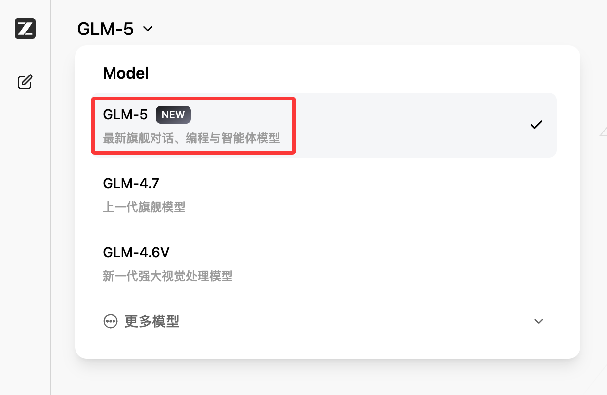

---

## 第一步：安装 VSCode

VSCode 是我们整个 AI 工作区的"大本营"。官网：[code.visualstudio.com](https://code.visualstudio.com/Download)

这是唯一一个需要你去官网点"Download"下载安装包的步骤。（如果你不知道下载哪个版本，那么截图去问上面的z.ai）

1. 打开浏览器，访问上面的官网，点击巨大的 **Download** 按钮。
2. 下载后双击安装包：
   - **Mac**：直接拖进"应用程序"文件夹即可。
   - **Win**：安装过程中如果你有自己放软件的盘和文件夹（比如 D 盘），记得在安装路径那一步点"浏览"改到你想放的位置（如 `D:\VSCode`），然后一路"下一步"。
3. 安装完成后，打开 VSCode。

> **[📷 截图占位：VSCode 首次打开的欢迎界面]**
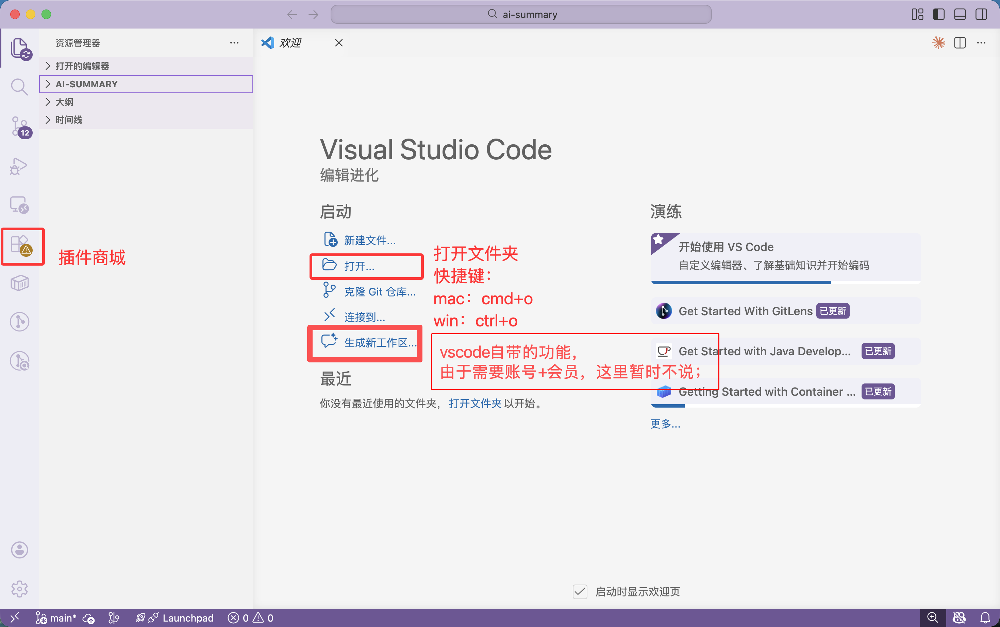

### 汉化（强烈推荐）

1. 点击左侧边栏最下面由几个方块组成的图标（**扩展 / Extensions**）。
2. 搜索 `Chinese`，找到 `Chinese (Simplified) (简体中文)`，点 `Install`。
3. 右下角弹框点 `Change Language and Restart`，重启后界面全中文。

> **[📷 截图占位：扩展市场搜索 Chinese 并点击 Install 的界面]**
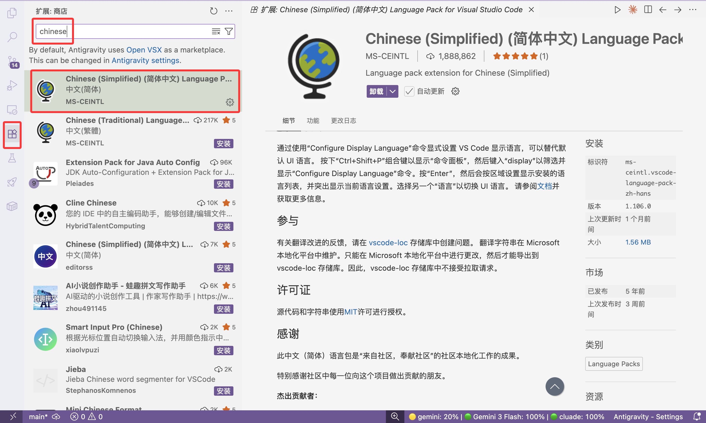

### 几个救命快捷键（先记住这三个就够了）

| 功能 | Windows | Mac |
|---|---|---|
| 打开文件夹 | `Ctrl + O` | `Cmd + O` |
| 打开/关闭终端 | `` Ctrl + J `` | `` Cmd + J `` |
| 打开命令面板 | `Ctrl + Shift + P` | `Cmd + Shift + P` |

> 💡 后面所有的安装命令，都是在 VSCode 的终端里敲的。按上面的快捷键打开终端就行。


---

## 第二步：安装前置环境（Node.js）

Claude Code 运行需要 Node.js 18 或更高版本。我们先检查你电脑里有没有，如果没有再装。

### 🔍 先检查：打开 VSCode 终端，输入

```bash
node -v
```

- **如果显示了版本号**（比如 `v18.17.0` 或 `v20.x.x`），而且大版本号 ≥ 18，说明已经装好，**跳过这一步**。
- **如果显示了版本号但 < 18**，需要更新，按下面的方式重新装一遍即可（会自动覆盖旧版本）。
- **如果报错 `command not found`** 或 `不是内部命令`，说明没装过，往下走。

> **[📷 截图占位：终端输入 node -v 后显示版本号的画面]**


### Mac 安装 Node.js（两行命令）

Mac 推荐用 Homebrew（终端版的"应用商店"）来装所有东西。


```bash
# 第 1 行：先装 Homebrew（如果你之前装过 brew，跳过这行）
/bin/bash -c "$(curl -fsSL https://raw.githubusercontent.com/Homebrew/install/HEAD/install.sh)"
```

> ⚠️ 这行命令执行时间较长（1-5 分钟），途中可能会让你输入电脑开机密码（输入时屏幕不会显示任何字符，这是正常的，盲打完回车就行）。
安装完，你还可以看看你的brew的版本

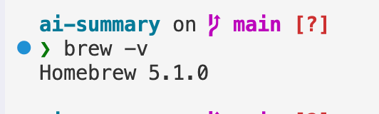

```bash
# 第 2 行：用 brew 安装 Node.js
brew install node
```

装完后再跑一次 `node -v`，看到版本号就说明成功了。

### Win 安装 Node.js（一行命令）

Win 11 或更新版本自带 `winget` 包管理器，直接在终端输入：

```bash
winget install OpenJS.NodeJS.LTS
```

装完后，**关掉当前终端，重新开一个新终端**（点终端右上角的 `+` 号），再输入 `node -v` 确认版本号。

> 💡 如果你的 Win 版本比较旧没有 winget，也可以去 [nodejs.org](https://nodejs.org/) 下载 LTS 安装包，双击一路下一步。

---

## 第三步：安装 Claude Code（两行命令）

Node.js 搞定后，我们来装真正的 AI 引擎。

### 🔍 先检查：

```bash
claude --version
```

- 如果显示了版本号，说明之前装过，**跳过这一步**。
- 如果报错 `command not found`，往下走。

### 正式安装

```bash
# 第 1 行：换国内镜像源（加速下载，避免网络卡住）
npm config set registry https://registry.npmmirror.com

# 第 2 行：全局安装 Claude Code
npm install -g @anthropic-ai/claude-code
```

> ⚠️ 不要在前面加 `sudo`，官方明确不建议。如果遇到权限报错，复制报错信息去 [z.ai](https://z.ai) 问一下，一般几句话就能解决。

装完后，**新开一个终端**（点右上角 `+`），输入：

```bash
claude --version
```

看到版本号（比如 `1.0.3`）就说明大脑引擎已经成功住进你的电脑了。

> **[📷 截图占位：终端显示 claude --version 输出版本号]**
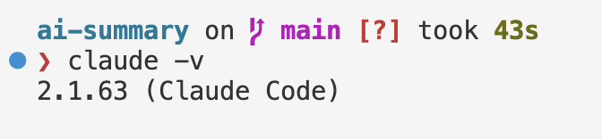

---

## 第四步：安装 CCSwitch（AI 的可视化遥控器）

CCSwitch 是把 Claude Code 的终端能力包装成好看的图形界面的工具。装了它之后你就不需要每次都对着黑框敲命令了。

官方仓库：[github.com/farion1231/cc-switch](https://github.com/farion1231/cc-switch/releases/latest)

一直下滑，找到Assets
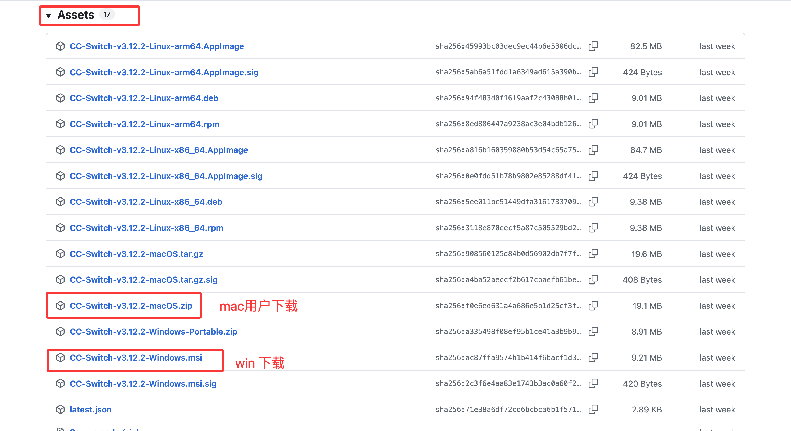

### Mac 安装（两行命令，推荐）

```bash
# 第 1 行：添加 CCSwitch 的 brew 源
brew tap farion1231/ccswitch

# 第 2 行：安装 CCSwitch
brew install --cask cc-switch

# 这是更新命令，当你的ccs提醒你需要更新的时候，打开终端，输入命令就行
brew upgrade --cask cc-switch
```

> ⚠️ 首次打开时 Mac 可能会弹出"未知开发者"警告。**不要慌**：先关掉弹窗，去"系统设置" → "隐私与安全性" → 找到下方的提示，点击"仍要打开"就行了。

> **[📷 截图占位：Mac "隐私与安全性"里点击"仍要打开"的界面]** 这里我就不截图了，不会的直接截图问ai


### Win 安装（需要下载安装包）

由于 GitHub 在国内有时打不开，这里我直接提供安装包的下载方式：

1. 下载 CCSwitch Windows 安装包，点开链接划到最下面的：`CC-Switch-v3.12.2-Windows.msi`
   > 📥 **下载地址**：[GitHub Releases](https://github.com/farion1231/cc-switch/releases/latest)（如果打不开，去 [z.ai](https://z.ai) 问"帮我找 CC-Switch 最新版 Windows 安装包的下载链接"）
2. 双击 `.msi` 文件安装。
   > ⚠️ **注意安装路径**：如果你有自己的软件文件夹（比如 D 盘），记得在安装过程中改路径，别全堆在 C 盘。
   
3. 安装完成后，打开 CCSwitch 应用。

> **[📷 截图占位：CCSwitch 安装完成后首次打开的主界面]**
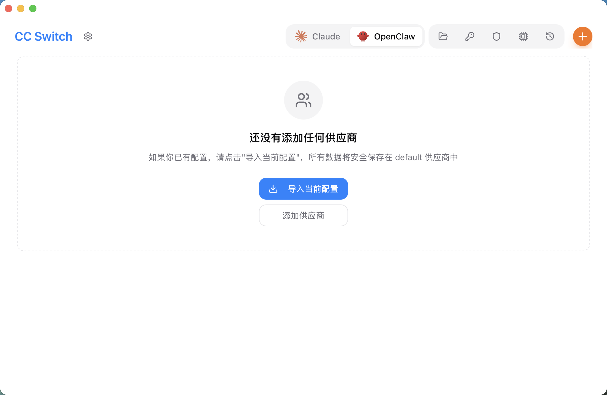
### 后续更新

```bash
# Mac 更新（终端执行）
brew upgrade --cask cc-switch
```

Win 用户：重新下载最新版 `.msi` 安装包覆盖安装即可。

---

## 第五步：连接大脑（获取并配置 API）

工具都装好了，现在需要给 AI "通电"——获取一个 API Key 并填进 CCSwitch 里。

### 什么是 API？一句话版本

你平时用的豆包、Kimi 网页版是"包月自助餐"。  
API 是"按字数点餐"——用多少算多少，对学生来说，很多时候甚至是**免费白嫖**。

### 选哪个平台？

不同平台的官网、注册方式、充值流程都不一样。为了简单演示，这里我用流程相对直接的 **MiniMax** 作为例子来讲；如果你想用别的平台，也可以直接看它们各自的官方文档。

| 平台 | 官方地址 |
|---|---|
| **Kimi (Moonshot)** | [platform.moonshot.cn](https://platform.moonshot.cn) |
| **阿里百炼 (Qwen)** | [bailian.console.aliyun.com](https://bailian.console.aliyun.com) |
| **智谱 (GLM)** | [open.bigmodel.cn](https://open.bigmodel.cn) |
| **MiniMax** | [platform.minimaxi.com](https://platform.minimaxi.com) |

### 具体配置（以 MiniMax 为例，这个平台最简单，其他平台流程类似）

**第 1 步：获取 API Key**

1. 打开 [platform.minimaxi.com](https://platform.minimaxi.com/subscribe/token-plan)，注册并完成实名认证。
2. 选择适合自己的套餐完成充值。为了先把流程跑通，这里直接按最简单的 MiniMax 方案演示即可。
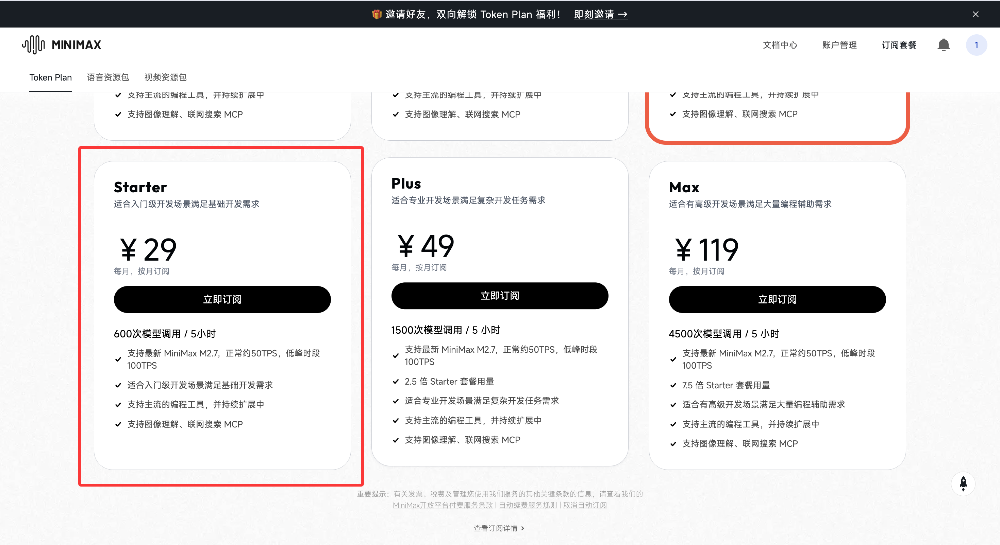
3. 购买完成之后，点击账户管理。

4. 系统会生成一串类似 `sk-xxxxxxxxxxxxxxxx` 的 Key。**点击复制，妥善保存。**

> ⚠️ **这串 Key 就是你的钱包密码，绝对不要发给任何人、不要截图发朋友圈。**

**第 2 步：在 CCSwitch 里填入配置**

打开 CCSwitch，找到设置界面，你需要填三个东西：

| 配置项 | 填什么 |
|---|---|
| **API Key** | 刚才复制的那串 `sk-xxxxxxx` |
| **API 地址 (Base URL)** | 按你所选平台的官方文档填写 |
| **模型名称 (Model)** | 按你所选平台的官方文档填写 |

> **[📷 截图占位：CCSwitch 设置页面，标注出 API Key、Base URL、Model 三个输入框的位置]**
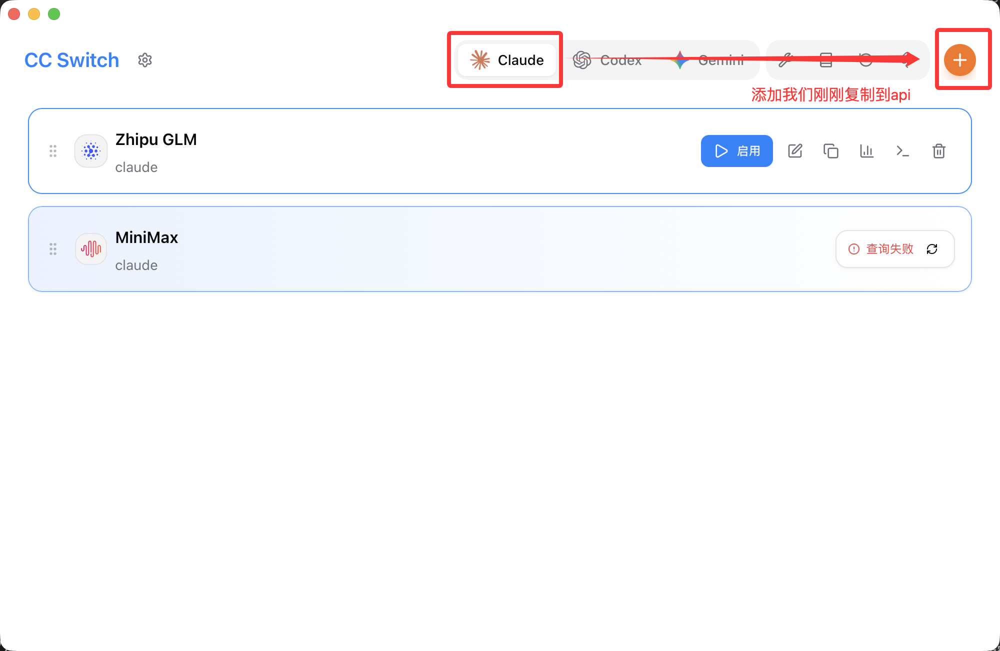
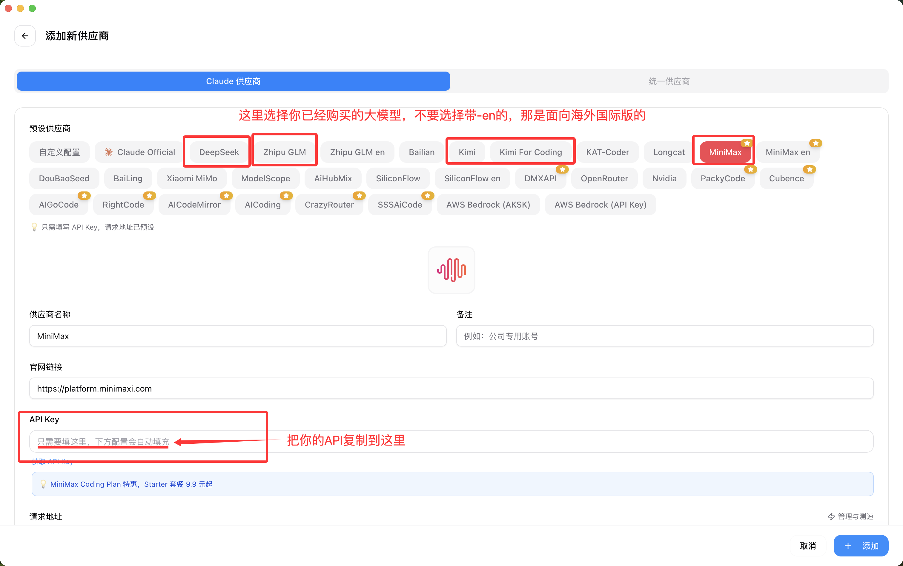
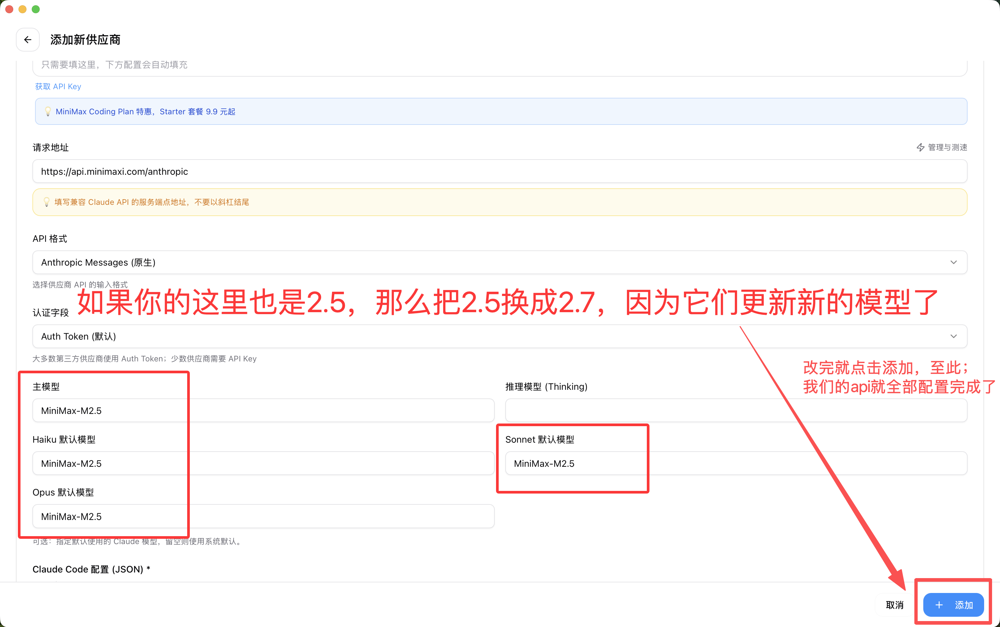

填完保存。恭喜！你的 AI 搭子正式入住你的电脑了！

---

## 第六步：在 VSCode 里安装并打开 Claude Code 插件

前面我们装好了命令行版 Claude Code，也配好了 CCSwitch。接下来还差一步：把 **Claude Code 插件**装进 VSCode，这样你以后可以直接在编辑器里和它配合工作。

### 第 1 步：安装 Claude Code 插件

1. 打开 VSCode 左侧的扩展市场。
2. 搜索 `Claude Code`。
3. 找到对应插件后，点击 `Install` 安装。

> **[📷 截图占位：VSCode 扩展市场中搜索并安装 Claude Code 插件的界面]**
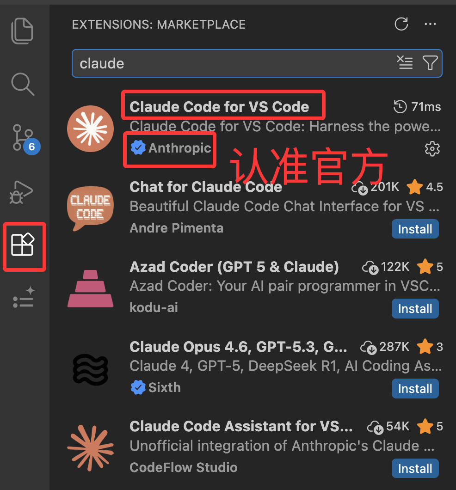

### 第 2 步：打开 Claude Code 插件

安装完成后，一般有两种常见打开方式：

1. 看左侧活动栏里有没有 Claude Code 的图标，直接点开。
2. 如果没看到，就按 `Ctrl + Shift + P`（Mac 按 `Cmd + Shift + P`），输入 `Claude Code`，从命令面板里打开。

> **[📷 截图占位：VSCode 中打开 Claude Code 插件面板的界面]**
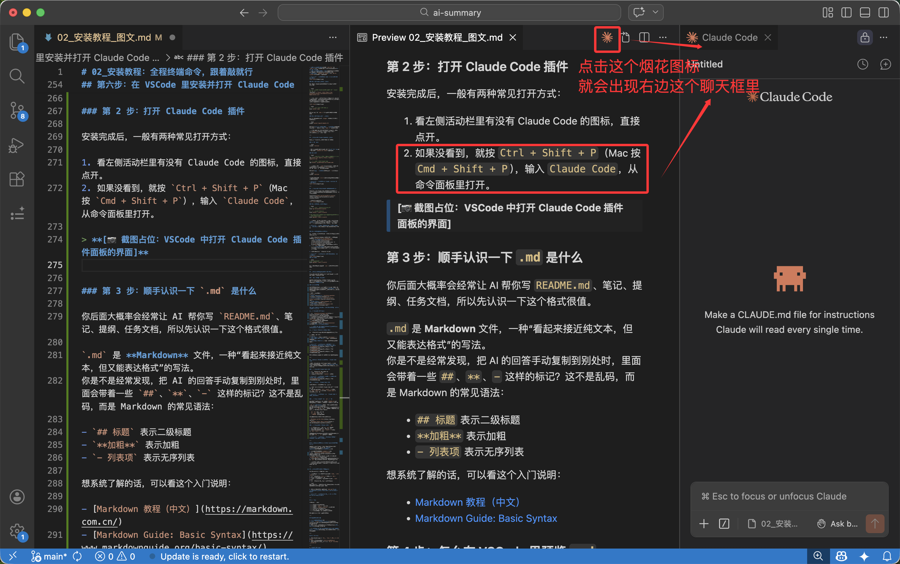

### 第 3 步：顺手认识一下 `.md` 是什么

你后面大概率会经常让 AI 帮你写 `README.md`、笔记、提纲、任务文档，所以先认识一下这个格式很值。

`.md` 是 **Markdown** 文件，一种“看起来接近纯文本，但又能表达格式”的写法。  
你是不是经常发现，把 AI 的回答手动复制到别处时，里面会带着一些 `##`、`**`、`-` 这样的标记？这不是乱码，而是 Markdown 的常见语法：

- `## 标题` 表示二级标题
- `**加粗**` 表示加粗
- `- 列表项` 表示无序列表

想系统了解的话，可以看这个入门说明：

- [Markdown 教程（中文）](https://markdown.com.cn/)
- [Markdown Guide: Basic Syntax](https://www.markdownguide.org/basic-syntax/)

### 第 4 步：怎么在 VSCode 里预览 `.md`

1. 在 VSCode 里打开任意一个 `.md` 文件。
2. 点击编辑器右上角的“打开预览”按钮。
3. 或者直接按快捷键 `Ctrl + Shift + V`（Mac 按 `Cmd + Shift + V`）。

这样你左边写 Markdown，右边就能看到排版后的效果，不用脑补 `##` 和 `**` 最终会长什么样。

> **[📷 截图占位：VSCode 中 Markdown 文件左侧源码、右侧预览的分栏界面]**分开的界面我就不截图了，前面图就已经有了奥！
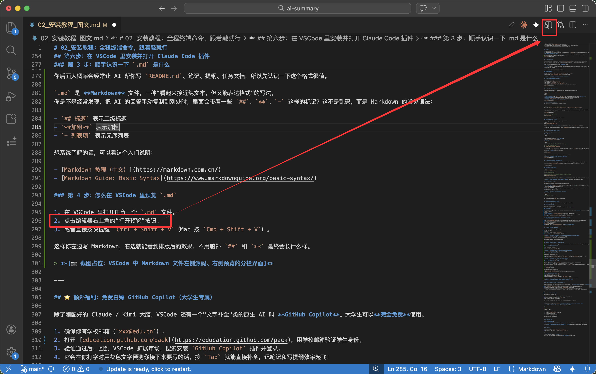
如果想要更好的体验，也可以下载一个插件，效果自行体会
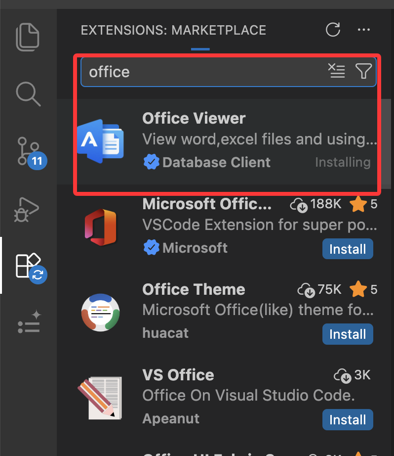

---

## 自检清单

到这里，`02 安装教程` 就结束了。最后别急着往下冲，先按你的系统自己检查一遍：

- [ ] VSCode 已安装并能正常打开
- [ ] 已安装中文语言包，界面大部分已经变成中文
- [ ] 打开终端。
  Windows 可以用 VSCode 终端或 Windows Terminal；macOS 可以用 VSCode 终端或系统终端
- [ ] 输入 `node -v`，能看到 18 以上版本号
- [ ] 在终端输入 `claude --version`，能看到版本号
- [ ] CCSwitch 已安装并能打开
- [ ] API Key 已经填进 CCSwitch，界面能正常保存
- [ ] VSCode 里的 Claude Code 插件已经安装完成，并且能从侧边栏或命令面板打开

### 最后做一个最简单的聊天验证

打开 VSCode 里的 Claude Code 对话框，直接对它说：

```text
你写一篇简短的自我介绍，语气自然一点，介绍一下你是什么模型？擅长什么？输出成 Markdown 格式在当前工作区。
```

如果它能正常回复，并且你能把这段内容放进 VSCode 里的 `.md` 文件中查看，那就说明整个安装流程已经基本跑通了。

> **[📷 截图占位：对话框中让 AI 生成自我介绍，并在 VSCode 中查看结果的界面]**
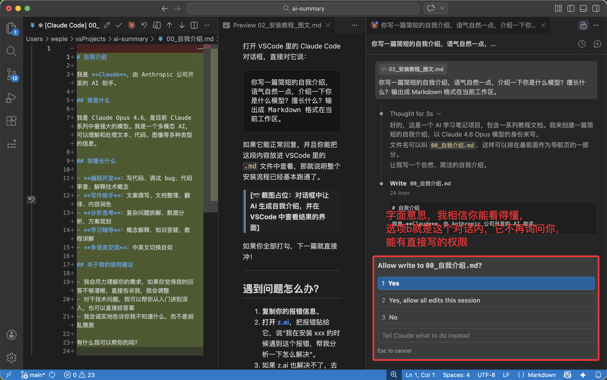

如果你全部打勾，下一篇就直接冲！

---

## 遇到问题怎么办？

1. **复制你的报错信息**。
2. **打开 [z.ai](https://z.ai)**，把报错贴给它，说"我在安装 xxx 的时候遇到这个报错，帮我分析一下怎么解决"。
3. 如果 z.ai 也解决不了，去飞书文档对应段落**划线批注**，我会帮你"云诊断"。

> 💡 **学会向 AI 求助、描述问题，这本身就是最重要的 AI 使用能力**。以后遇到任何软件问题，这个习惯都会帮到你。

---

## 下一步看哪里

1. 如果已经全部跑通 → `03_第一次任务实操_课程论文版.md`
2. 如果中间步骤报错了 → `04_常见报错FAQ.md`
3. 如果想先把工作区模板准备好 → `05_学习工作区模板与示例.md`

---

💬 **【互动交流】**  
本系列教程已首发并同步更新在**飞书知识库**。  
如果在任何一步卡住了，请直接在飞书文档对应段落**划线批注提问**，我会逐一回复！
