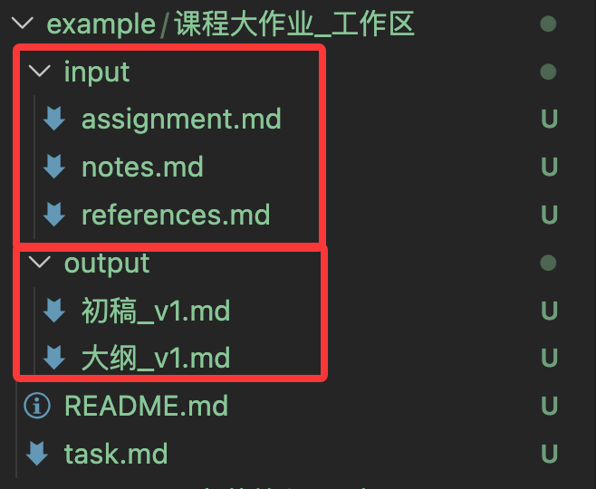
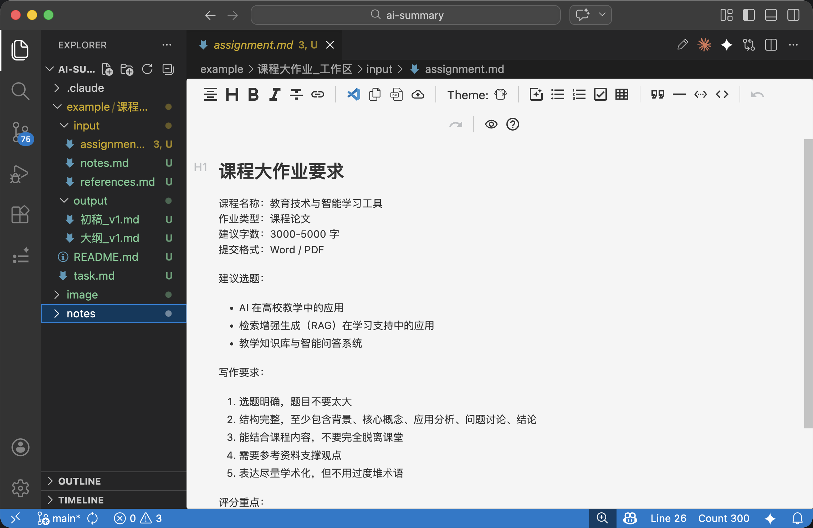
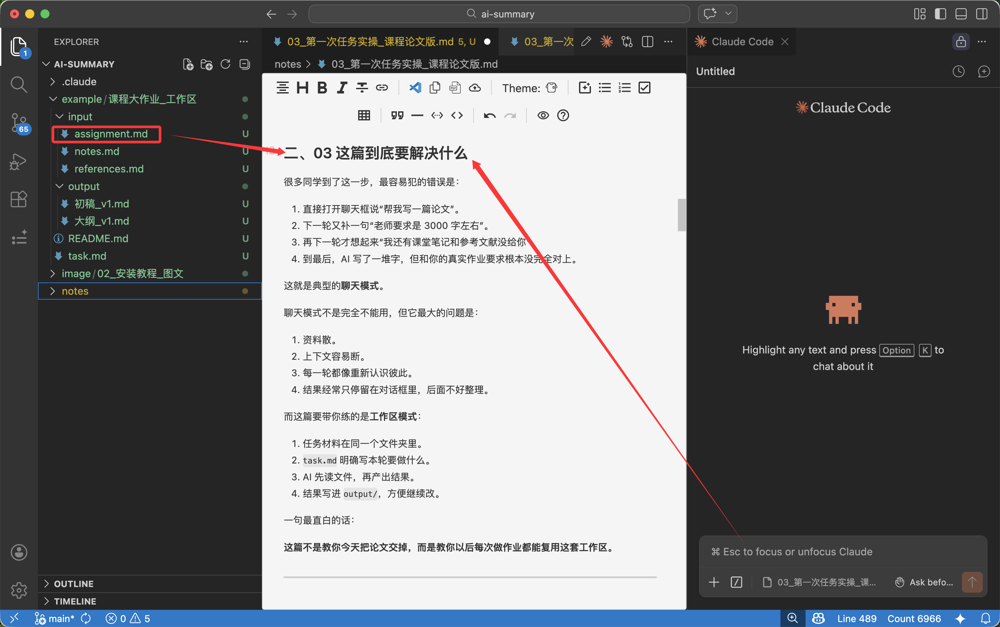
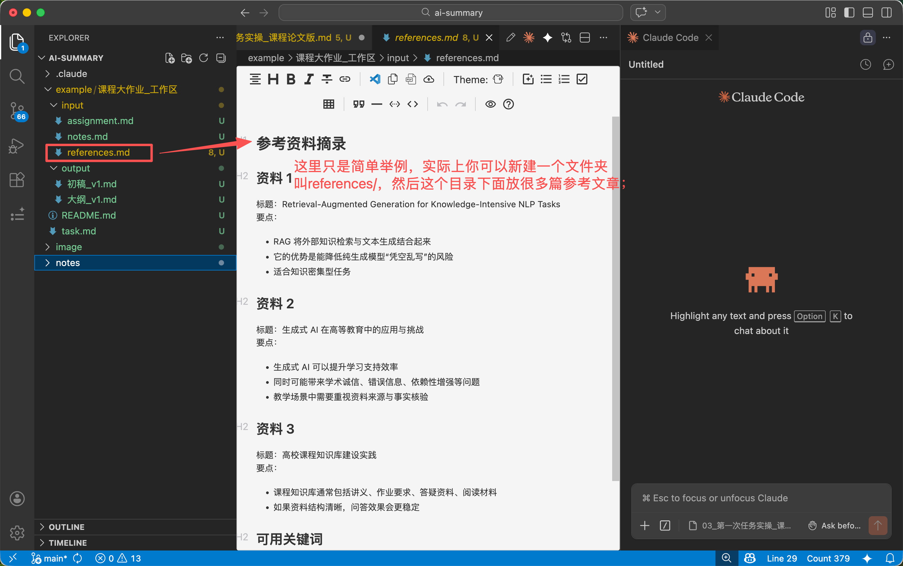
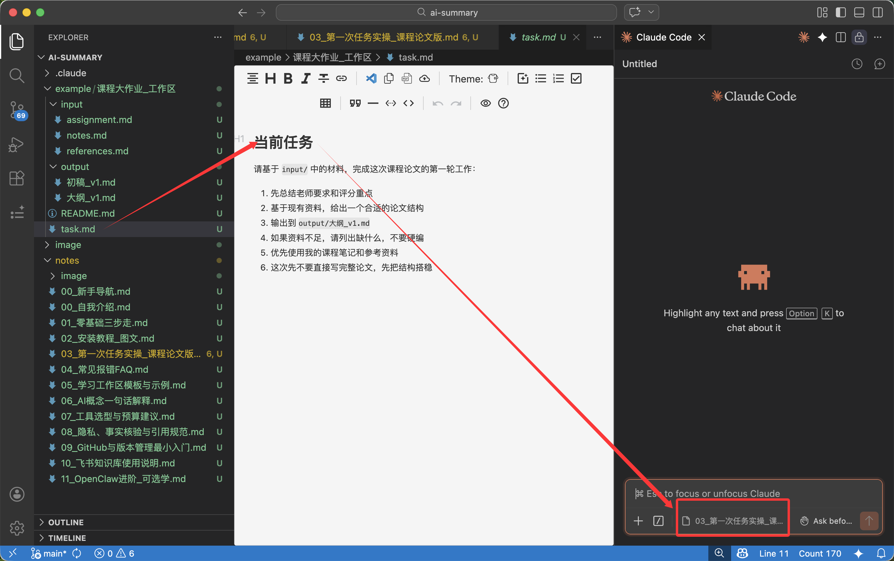
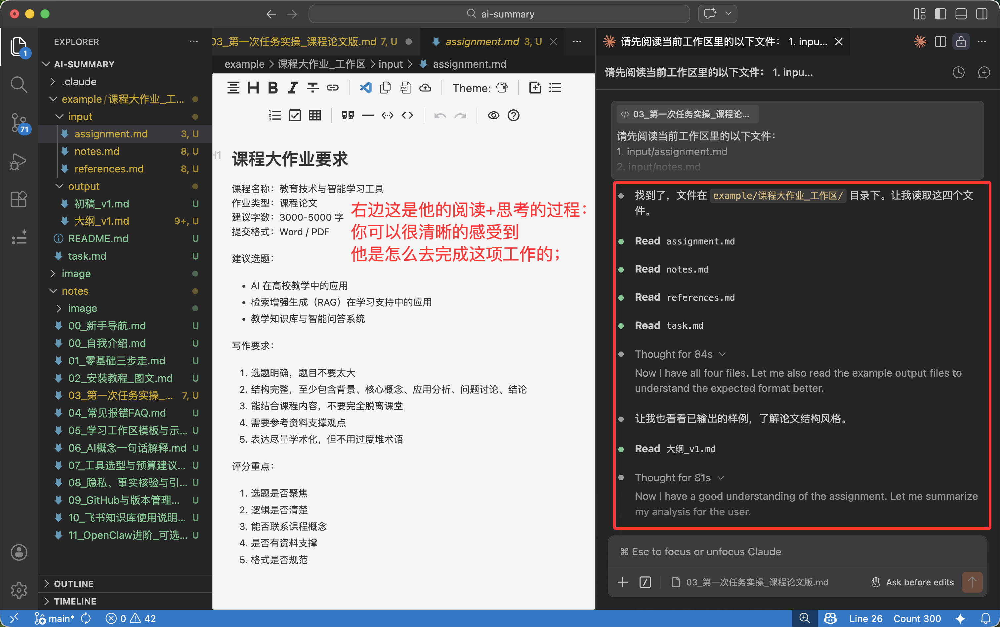
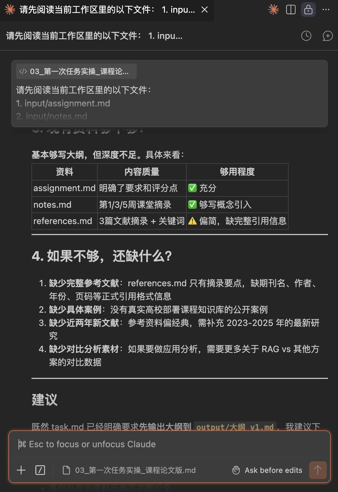
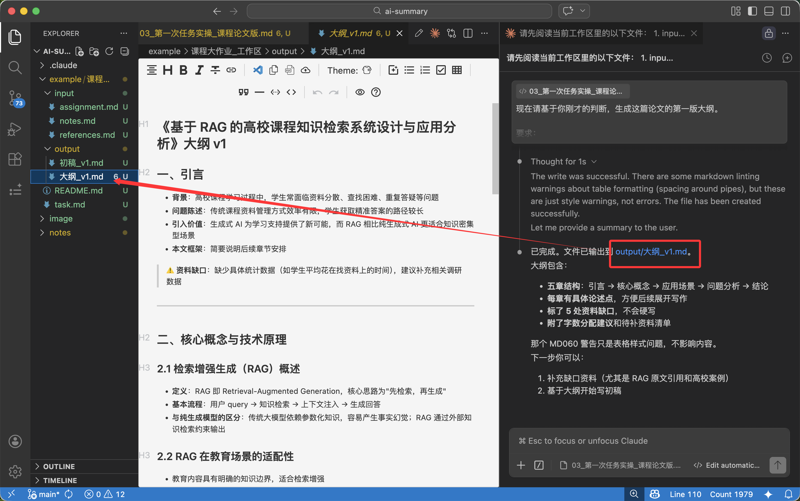
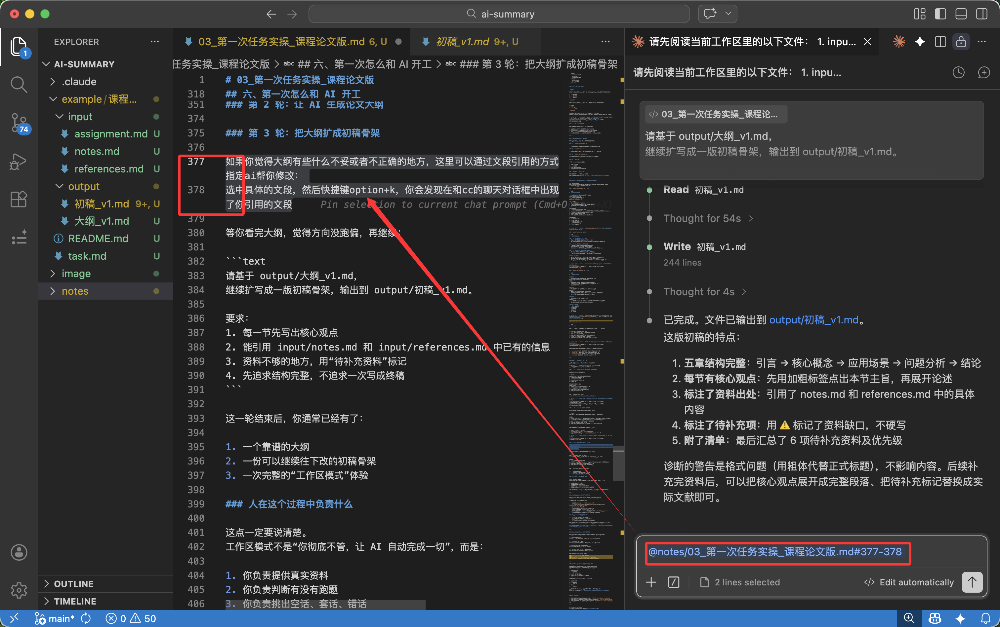

# 03_第一次任务实操_课程论文版

> 作者：mong  
> 最后更新：2026-03-20  
> 适合人群：已经完成 `02_安装教程_图文.md`，准备第一次真正用 AI 跑学习任务的同学

<!-- // todo lm: 这篇正文整体已经能用了，但飞书版还可以再压缩 10%-15%，尤其是大段样例和重复强调的地方。 -->

## 先说结论
这篇不是让你今天真的把论文交上去。  
这篇真正要带你做成的，是第一次跑通一套**课程大作业工作区**：

1. 把老师要求、课堂笔记、参考资料放进同一个文件夹。
2. 用 `task.md` 给 AI 下任务，而不是在聊天框里随缘发挥。
3. 让 AI 先读资料、再出大纲、再扩成初稿骨架。
4. 让结果落到文件里，而不是漂在对话框里。

你可以把这篇理解成：
**“第一次让 AI 真正围着一项课程任务连续工作。”**

> 💡 这篇重点不是“神 prompt”，而是“文件夹 + 资料 + `task.md` + 多轮迭代”。

---

## 一、先给你一个真实任务壳子

为了让你有代入感，我们这篇直接假设你现在要完成一份课程大作业。

### 这次示例题目

**《基于 RAG 的高校课程知识检索系统设计与应用分析》**

这个题目适合拿来做教程，有几个原因：

1. 它和 AI 学习场景贴得很近，读者容易理解。
2. 它既有技术味，又不会难到必须真的写代码。
3. 它天然适合讲“先看资料，再生成内容”的工作区逻辑。

### 假设老师是这样布置的

你可以把下面这段，理解成老师发在群里或教学平台上的作业要求：

```text
课程名称：教育技术与智能学习工具
作业形式：课程大作业 / 小论文
字数要求：3000-5000 字
提交形式：Word 或 PDF

题目方向：
请围绕“AI 在高校教学中的应用”任选一个具体方向展开分析。
可选方向包括但不限于：
1. 检索增强生成（RAG）在课程知识问答中的应用
2. 智能学习助手在课程辅导中的使用场景
3. 教学知识库与生成式 AI 的结合

写作要求：
1. 题目明确，结构完整
2. 需要说明研究背景、核心概念、应用场景、存在问题
3. 可以结合课堂内容、自己的观察或公开资料展开
4. 必须有基本参考资料，不要完全脱离材料空想
5. 引用表达尽量规范

评分参考：
1. 选题是否清晰
2. 结构是否完整
3. 是否能结合课程概念
4. 论述是否言之有物
5. 格式是否基本规范
```

这里你先别急着开始问 AI。  
**第一次真正重要的，不是“让 AI 立刻开写”，而是先把任务装进一个工作区里。**

---

## 二、03 这篇到底要解决什么

很多同学到了这一步，最容易犯的错误是：

1. 直接打开聊天框说“帮我写一篇论文”。
2. 下一轮又补一句“老师要求是 3000 字左右”。
3. 再下一轮才想起来“我还有课堂笔记和参考文献没给你”。
4. 到最后，AI 写了一堆字，但和你的真实作业要求根本没完全对上。

这就是典型的**聊天模式**。

聊天模式不是完全不能用，但它最大的问题是：

1. 资料散。
2. 上下文容易断。
3. 每一轮都像重新认识彼此。
4. 结果经常只停留在对话框里，后面不好整理。

而这篇要带你练的是**工作区模式**：

1. 任务材料在同一个文件夹里。
2. `task.md` 明确写本轮要做什么。
3. AI 先读文件，再产出结果。
4. 结果写进 `output/`，方便继续改。

一句最直白的话：

**这篇不是教你今天把论文交掉，而是教你以后每次做作业都能复用这套工作区。**

---

## 三、先别急着问 AI，先搭工作区

这次我们先搭一个最小可用的课程大作业工作区。

```text
课程大作业_工作区/
  input/
    assignment.md
    notes.md
    references.md
  output/
    大纲_v1.md
    初稿_v1.md
  task.md
```

### 每个位置是干什么的

`input/`

这里放“输入材料”，也就是 AI 不应该乱猜、而应该优先参考的内容：

1. 老师要求
2. 课堂笔记
3. 参考资料

`output/`

这里放“结果文件”，也就是 AI 和你共同打磨出来的内容：

1. 大纲
2. 初稿
3. 后续改稿

`task.md`

这里不是资料库，而是这一轮工作的**任务单**。  
你可以把它理解成：“这次到底让 AI 干什么、输出到哪里、注意什么边界”。

> **[📷 截图占位：VSCode 中新建 `课程大作业_工作区` 后，左侧文件树出现 `input/`、`output/`、`task.md` 的界面]**


### 为什么一定要这么分

因为这样分完之后，人和 AI 都不会乱：

1. 你知道哪里放老师要求，哪里放结果。
2. AI 知道哪些是输入材料，哪些是输出文件。
3. 下一轮继续做时，不需要重新从零解释。
4. 后面换成别的课程作业，也能直接复用这套结构。

---

## 四、这次需要哪些参考文件

这一篇里，我们只用 4 个核心文件就够了：

### 1. `input/assignment.md`

放老师要求、字数、评分点、提交格式、题目范围。

### 2. `input/notes.md`

放课堂笔记、老师讲过的概念、你自己的观察和理解。

### 3. `input/references.md`

放参考资料摘要、网页要点、文献摘录、关键词。

### 4. `task.md`

放这一轮任务说明，比如：

1. 先总结要求
2. 再出大纲
3. 输出到哪个文件
4. 遇到资料不够时怎么处理

### `output/` 先留空就行

这个文件夹一开始可以是空的。  
因为它的意义就是：**等 AI 真正开始干活之后，把结果落进来。**

---

## 五、把参考文件怎么准备，写成可抄的样例

这一段很重要。  
很多人知道“要建文件夹”，但不知道每个文件里到底应该写什么。  
所以我直接给你一套可以抄的样例。

### `input/assignment.md` 示例

```md
# 课程大作业要求

课程名称：教育技术与智能学习工具
作业类型：课程论文
建议字数：3000-5000 字
提交格式：Word / PDF

建议选题：
- AI 在高校教学中的应用
- 检索增强生成（RAG）在学习支持中的应用
- 教学知识库与智能问答系统

写作要求：
1. 选题明确，题目不要太大
2. 结构完整，至少包含背景、核心概念、应用分析、问题讨论、结论
3. 能结合课程内容，不要完全脱离课堂
4. 需要参考资料支撑观点
5. 表达尽量学术化，但不用过度堆术语

评分重点：
1. 选题是否聚焦
2. 逻辑是否清楚
3. 能否联系课程概念
4. 是否有资料支撑
5. 格式是否规范
```

<!-- // todo lm: 这个“老师作业单”块已经够真实，但如果飞书阅读节奏想更轻一点，可以再压缩成“要求 + 评分点”两部分。 -->

> **[📷 截图占位：打开 `input/assignment.md`，能看到老师要求、字数、评分点的界面]**


### `input/notes.md` 示例

```md
# 课堂笔记摘录

## 第 1 周：生成式 AI 基础
- 大模型擅长生成，但容易出现事实幻觉
- 如果没有可靠资料约束，输出内容可能看起来通顺但不准确

## 第 3 周：知识库与问答系统
- 传统问答系统依赖预先整理好的知识库
- RAG 的核心思路是：先检索，再生成
- 适合用在课程资料问答、教学资源整合、学习辅导场景

## 第 5 周：AI 在高校教学中的应用
- 可以用于答疑、资料整理、学习路径推荐
- 也可能带来引用不规范、过度依赖、事实错误等问题

## 我自己的想法
- 如果每门课都能有一个课程知识库，学生复习时会更方便
- 但前提是资料来源要可靠，不能让 AI 自己乱编
- 这个方向适合写“应用分析”类论文，不一定要真的做系统开发
```

> **[📷 截图占位：打开 `input/notes.md`，能看到按课程周次整理的课堂笔记界面]**


### `input/references.md` 示例

```md
# 参考资料摘录

## 资料 1
标题：Retrieval-Augmented Generation for Knowledge-Intensive NLP Tasks
要点：
- RAG 将外部知识检索与文本生成结合起来
- 它的优势是能降低纯生成模型“凭空乱写”的风险
- 适合知识密集型任务

## 资料 2
标题：生成式 AI 在高等教育中的应用与挑战
要点：
- 生成式 AI 可以提升学习支持效率
- 同时可能带来学术诚信、错误信息、依赖性增强等问题
- 教学场景中需要重视资料来源与事实核验

## 资料 3
标题：高校课程知识库建设实践
要点：
- 课程知识库通常包括讲义、作业要求、答疑资料、阅读材料
- 如果资料结构清晰，问答效果会更稳定

## 可用关键词
- 检索增强生成
- 课程知识库
- 智能问答
- 高校教学
- 学习支持
```

> **[📷 截图占位：打开 `input/references.md`，能看到文献摘要和关键词整理界面]**



### `task.md` 示例

```md
# 当前任务

请基于 input/ 中的材料，完成这次课程论文的第一轮工作：

1. 先总结老师要求和评分重点
2. 基于现有资料，给出一个合适的论文结构
3. 输出到 output/大纲_v1.md
4. 如果资料不足，请列出缺什么，不要硬编
5. 优先使用我的课程笔记和参考资料
6. 这次先不要直接写完整论文，先把结构搭稳
```

> **[📷 截图占位：打开 `task.md`，能看到任务目标、输出位置、边界要求的界面]**


你会发现，这里最关键的不是文采，而是信息分工清楚：

1. `assignment.md` 负责告诉 AI：老师到底要什么
2. `notes.md` 负责告诉 AI：课堂上到底讲了什么
3. `references.md` 负责告诉 AI：有哪些外部支撑
4. `task.md` 负责告诉 AI：这轮具体做什么

---

## 六、第一次怎么和 AI 开工

到这里你才该打开 Claude Code 的对话框。

注意，**第一轮千万别直接说“帮我写一篇论文”**。  
第一次最稳的做法，是把任务拆成三轮。

### 第 1 轮：先读资料，提炼要求和评分重点

你可以在对话框里这样说：

```text
请先阅读当前工作区里的以下文件：
1. input/assignment.md
2. input/notes.md
3. input/references.md
4. task.md

先不要直接写论文。
请先总结：
1. 这次课程作业的核心要求是什么
2. 老师最可能看重哪些评分点
3. 现有资料够不够支撑这次选题
4. 如果不够，还缺什么
```

这一轮的目的只有一个：
**让 AI 先进入任务，而不是先进入表演。**

> **[📷 截图占位：Claude Code 对话框中，AI 先读取材料并总结要求的界面]**



### 第 2 轮：让 AI 生成论文大纲

当它已经理解要求之后，再推进到下一步：

```text
现在请基于你刚才的判断，生成这篇论文的第一版大纲。

要求：
1. 题目暂定为《基于 RAG 的高校课程知识检索系统设计与应用分析》
2. 结构要包含：引言、核心概念、应用场景、问题分析、结论
3. 语言风格偏课程论文，不要过度口语化
4. 输出到 output/大纲_v1.md
5. 如果某部分资料不够，请在大纲里标出来，不要硬写
```

这里的重点不是“大纲写得多漂亮”，而是：

1. 结果开始落进 `output/`
2. AI 不再只是聊天，而是在帮你搭文件
3. 你后面可以直接对着 `output/大纲_v1.md` 继续改

> **[📷 截图占位：AI 根据任务单把结果写入 `output/大纲_v1.md` 的界面]**


### 第 3 轮：把大纲扩成初稿骨架

> [!TIP]
> **如果你觉得大纲里有不妥或不准确的地方，不要整段重新描述。**
> 最稳的做法是：**直接选中具体文段，再用引用的方式让 AI 按段修改。**
>
> 具体操作：
> 选中你想改的那一段，按快捷键 `Option + K`，你会发现这段文字会自动出现在 Claude Code 的对话框里。
> 这样 AI 会更清楚你到底想改哪一段，修改也会更准。



等你看完大纲，觉得方向没跑偏，再继续：

```text
请基于 output/大纲_v1.md，
继续扩写成一版初稿骨架，输出到 output/初稿_v1.md。

要求：
1. 每一节先写出核心观点
2. 能引用 input/notes.md 和 input/references.md 中已有的信息
3. 资料不够的地方，用“待补充资料”标记
4. 先追求结构完整，不追求一次写成终稿
```

这一轮结束后，你通常已经有了：

1. 一个靠谱的大纲
2. 一份可以继续往下改的初稿骨架
3. 一次完整的“工作区模式”体验

### 人在这个过程中负责什么

这点一定要说清楚。  
工作区模式不是“你彻底不管，让 AI 自动完成一切”，而是：

1. 你负责提供真实资料
2. 你负责判断有没有跑题
3. 你负责挑出空话、套话、错话
4. 你负责决定哪些内容保留、哪些要补充

AI 的角色更像一个能连续干活的搭子，而不是最后签字负责的人。

---

## 七、这篇做到哪里，算真的完成

这篇教程的完成标准，不是“论文终稿已经可以提交”。

真正的完成标准是下面这些：

- [ ] 你已经建好了 `课程大作业_工作区`
- [ ] `input/assignment.md`、`input/notes.md`、`input/references.md` 已经放进去了
- [ ] `task.md` 已经写好
- [ ] AI 已经先读材料，再给出要求总结
- [ ] AI 已经生成 `output/大纲_v1.md`
- [ ] 如果你愿意继续做，它还能往下扩成 `output/初稿_v1.md`
- [ ] 你已经理解“聊天模式”和“工作区模式”的区别

### 这篇明确不要求你完成的事

- [ ] 今天就把整篇论文彻底写完
- [ ] 今天就把所有引用格式校到完美
- [ ] 今天就完全不改 AI 的内容直接提交

如果你现在已经能理解这句话，说明这篇最核心的部分你已经吃透了：

**真正重要的不是今天这篇 RAG 小论文本身，而是你已经学会了以后怎么用一个工作区去推进任何课程任务。**

---

<!-- // todo lm: 原来“哪些截图最重要”这一节更像作者制作提示，已经从正文里移除。后续如果还要保留，建议单独放到图文制作清单，不放给读者看。 -->

## 八、这一篇看完后，你应该带走什么

你不需要立刻变成“会写论文 prompt 的高手”。  
你真正应该带走的，是下面这套最小做事方法：

1. 先建工作区
2. 再放资料
3. 再写 `task.md`
4. 再让 AI 分轮推进
5. 最后让结果落文件、继续迭代

这套方法能用在课程论文，也能用在：

1. 读书报告
2. 课堂展示稿
3. 开题报告
4. 周报
5. 简历修改

也就是说，`03` 不是一篇只服务“RAG 论文”的教程，  
它其实是在教你：**第一次把 AI 从聊天搭子，变成工作流搭子。**

<!-- // todo lm: 这里和前面的“做到哪里算完成”有轻微重复，但这段保留是有价值的，因为它负责把“本篇方法可以迁移到别的任务”这件事点明。 -->

---

## 下一步看哪里

1. 如果你已经能跑通这篇的工作区 → `05_学习工作区模板与示例.md`
2. 如果你中间出现各种命令、插件、读文件问题 → `04_常见报错FAQ.md`
3. 如果你还担心 AI 乱写、乱引、乱编 → `08_隐私、事实核验与引用规范.md`

---

💬 **【互动交流】**  
本系列教程已首发并同步更新在**飞书知识库**。  
如果你在实操 `03` 的过程中卡住了，比如“不知道 `task.md` 该怎么改”或者“AI 没有按文件输出结果”，欢迎直接在飞书文档对应段落**划线批注提问**，我会继续把这些真实问题补进后面的模板和 FAQ。
